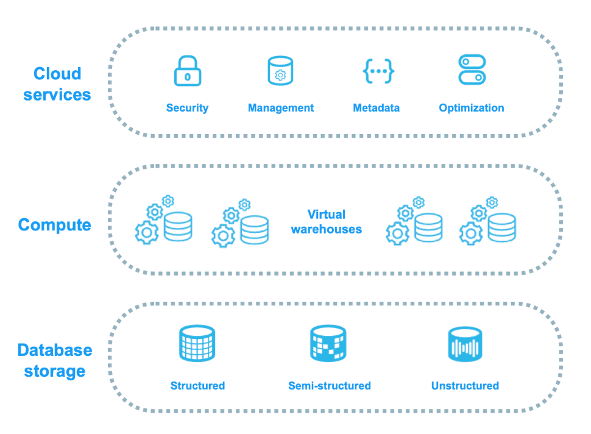

# Snowflake Architecture Notes

* Refer here for [Snowflake Documentation](https://docs.snowflake.com/en/)

## 🏗️ Three Layers
```
Cloud Services Layer
    ↓ (manages)
Virtual Warehouse Layer
    ↓ (processes)
Storage Layer
```
* Snowflake architecture :
* 


## 🔑 Key Components

### 1. Cloud Services Layer
- Auth & security
- Query parsing & optimization
- Metadata management
- Transaction handling
- **NO credits consumed** (free!)


### 2. Virtual Warehouse Layer (Compute)
- Independent compute clusters
- Scale up/down as needed
* ```NOTE```: The current advanced settings are auto-resume: on, auto-suspend: 5mins, multi-cluster: off, query acceleration: on
- Auto-suspend after 5 mins idle
    - Billing is based on the time the warehouse is active, so auto-suspend can help save costs by pausing the warehouse when not in use. For example, if a warehouse is idle for 10 minutes, it will automatically suspend, preventing unnecessary charges. Users can also manually resume the warehouse when needed.

* Virtual warehouse sizes depend on :
    * the operations being performed and the environment. 
    * For example, a small warehouse (XS) is suitable for light workloads and testing, while a larger warehouse (4XL) can handle heavy workloads and large data processing tasks. The ability to scale up or down allows users to optimize performance and cost based on their specific needs.

* Warehouse sizes from XS to 6XL, with corresponding credit costs. For instance, an XS warehouse costs 1 credit per hour, while a 4XL warehouse costs 8 credits per hour. This pricing model allows users to choose the appropriate warehouse size based on their workload requirements and budget constraints.
* Refer here for [Warehouse Pricing](https://www.snowflake.com/legal-files/CreditConsumptionTable.pdf)

* you can increase size of warehouse using webui or SQL command   


### 3. Storage Layer
- Columnar format (fast queries)
- Micro-partitions (50-500MB chunks  50 MB to  500 MB )
- Auto-compression
- Cloud-agnostic (AWS/Azure/GCP)

- Metadata of micro partitions include:(It will be one by cloud services layer)
  - Column statistics (min/max, distinct count)
  - range of values of each field in the micro-partition
 
- clustering keys are defined on columns to optimize query performance by reducing the number of micro-partitions scanned.
-  When a clustering key is defined, Snowflake organizes the data in the table based on the values in the specified columns. This allows Snowflake to quickly identify and scan only the relevant micro-partitions when executing queries that filter on those columns, improving query performance.

- query pruening:  - It is elimiation of not relevant micro-partitions based on the clustering keys defined on the table. When a query is executed, Snowflake uses the metadata of the micro-partitions to determine which partitions are relevant to the query based on the clustering keys. This process helps to reduce the amount of data that needs to be scanned, resulting in faster query performance.

- Define cluster keys on :
    - columns frequently used in WHERE clauses
    - columns with high cardinality (many distinct values)
    - columns used in JOIN conditions
    - Frequently used functions or expressions in queries like( LIKE YEAR(date),SUBNSTRING(med_cd,1,6) )
 

- Snowflake recommends:
    - Define clustering keys on large tables not on small tables
    - Avoid clustering keys on columns with low cardinality (few distinct values)
    - Don't define cluster keys on more than 4 columns


  

## 🔄 Query Flow
User → SQL Query → Cloud Services → Optimize → Virtual Warehouse → Execute → Results

## 📊 Core Objects
- Databases → Schemas → Tables
- Views, Materialized Views
- Stages (internal/external)
- Pipes (continuous loading)
- Metadata caching
- Clustering keys for pruning
- Auto-statistics

## 📈 Scaling
- Horizontal: add more warehouses
- Vertical: bigger warehouse size
- Elastic: auto-adjust
- Unlimited concurrency

## ⏰ Data Features
- Time Travel: query past data (90 days)
- Fail-Safe: recovery (7 days)
- Cloning: zero-copy duplicates
- Data Sharing: cross-account without moving data

## 💰 Cost Tips
- Pay only for compute used
- Storage separate charge
- Auto-suspend saves money
- Multi-cluster for efficiency

## 🔗 Connectivity
- Web UI
- SnowSQL CLI
- JDBC/ODBC drivers
- REST API
- Private Link options

## 📥 Data Loading
- COPY command (bulk)
- Snowpipe (continuous)
- Kafka connector
- Native SaaS connectors

## 📤 Data Unloading
- UNLOAD to cloud storage
- Multiple formats (CSV, JSON, Parquet)
* **Compute Tiers**: Standard, Business Critical, and On-Demand (Legacy)
* **Savings Plans**: Commit to hourly spend for discounts
* **Reserved Capacity**: Pre-purchase compute capacity at reduced rates
* **Auto-Suspend**: Automatically pause unused warehouses 


