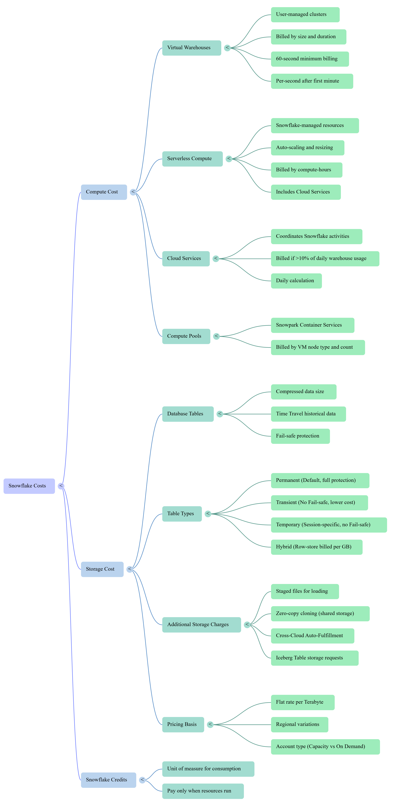

For the **Snowflake Enterprise Edition**, the total cost is divided into three main categories: **Compute**, **Storage**, and **Data Transfer**.

### **1. Compute Cost (Credits)**
Compute usage is measured in Snowflake credits, which are billed based on the number of credits used multiplied by the price per credit.
*   **Virtual Warehouses**: User-managed clusters used for queries and data loading. They are billed **per-second** with a **60-second minimum** each time the warehouse starts.
*   **Warehouse Pricing Example**: Credits for Enterprise Edition are typically priced higher than Standard (e.g., ~$4.00 per credit vs. ~$2.00 for Standard).
    *   **Small**: 2 credits/hr.
    *   **Medium**: 4 credits/hr.
    *   **Large**: 8 credits/hr.
*   **Cloud Services**: Background tasks like authentication and query optimization. You are only billed if daily usage **exceeds 10%** of your daily warehouse usage.
*   **Serverless**: Snowflake-managed features (like Snowpipe) that scale automatically and are billed per compute-hour.

### **2. Storage Cost (Per TB)**
Storage is billed at a flat monthly rate per **Terabyte (TB)** based on the average daily amount of compressed data stored.
*   **Billing Price**: A common example price is approximately **$23 per TB** per month.
*   **Enterprise Time Travel**: Enterprise Edition allows you to retain historical data for up to **90 days** (compared to 1 day in Standard).

#### **Table Type Cost Differences**
The type of table you use determines how much historical data (Time Travel and Fail-safe) you pay for.

| Table Type | Time Travel (Enterprise) | Fail-safe | Total History Billed |
| :--- | :--- | :--- | :--- |
| **Permanent** | 0 to 90 Days | 7 Days | **7 to 97 Days** |
| **Transient** | 0 or 1 Day | 0 Days | **0 to 1 Day** |
| **Temporary** | 0 or 1 Day | 0 Days | **0 to 1 Day** |

*   **Hybrid Tables**: Billed at a flat monthly rate per **Gigabyte (GB)**. The row-store copy is more expensive than standard storage.

### **3. Data Transfer Cost**
Costs depend on whether data is moving in, out, or within the Snowflake network.
*   **Data Ingress (In)**: Moving data into Snowflake is **free**.
*   **Data Egress (Out)**: Moving data to a **different region** or a **different cloud platform** incurs a per-byte/per-terabyte fee.
*   **Same-Region**: Transfers within the same cloud region are **free**.

### Types of views :

| Feature                   | Standard View                     | Secure View                                 | Materialized View                      |
| ------------------------- | --------------------------------- | ------------------------------------------- | -------------------------------------- |
| Definition                | Virtual table based on SQL query  | Virtual table with hidden logic             | Physically stored precomputed results  |
| Data storage              | ❌ No storage                      | ❌ No storage                                | ✅ Stores data                          |
| Query result source       | Runs underlying query every time  | Runs underlying query every time            | Reads precomputed results              |
| Performance               | Depends on base tables            | Depends on base tables                      | ⚡ Fast (precomputed)                   |
| Data freshness            | Always real-time                  | Always real-time                            | Near real-time (auto refreshed)        |
| Security                  | Normal access                     | 🔐 Hides SQL logic & sensitive columns      | Same as table permissions              |
| Use case                  | Simple abstraction, reuse queries | Secure data sharing, sensitive data masking | Fast analytics, aggregations           |
| Maintenance               | None                              | None                                        | Requires compute + storage maintenance |
| Cost impact               | Low                               | Low                                         | Higher (storage + compute)             |
| Can be queried like table | Yes                               | Yes                                         | Yes                                    |
